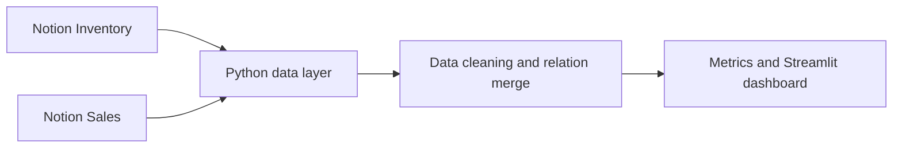

# James Resale — Notion Inventory Tracker

A portfolio-ready inventory and sales analytics system for a multi-platform resale business. Notion acts as the operational database, while Python and Streamlit turn inventory and sales records into useful performance metrics.

## What the project does

- Tracks products across Vinted, eBay, and Depop
- Links every sale to its inventory item through a Notion relation
- Calculates stock remaining, revenue, profit, ROI, and sell speed
- Highlights products below their minimum price
- Separates potential, expected, minimum, and realised profit
- Provides a Streamlit dashboard for business monitoring

## Architecture



## Repository structure

```text
notion-inventory-tracker/
├── app.py                  # Complete dashboard and Notion integration
├── docs/
│   ├── architecture.md
│   ├── database-schema.md
│   └── setup.md
├── .env.example
├── .gitignore
├── CONTRIBUTING.md
├── LICENSE
└── requirements.txt
```

## Dashboard metrics

The dashboard reports:

- total revenue;
- units sold;
- realised profit and ROI;
- average sell speed;
- cost of sold inventory;
- potential, expected, and minimum profit still available in stock.

Financial metrics use `cost price × quantity sold` for supplier cost. Each Sales row's `Sold Price` is treated as the total revenue for that sales line, matching the live Notion workflow.

## Quick start

1. Clone the repository and create a virtual environment.
2. Install dependencies with `pip install -r requirements.txt`.
3. Copy `.env.example` to `.env` and add your Notion integration values.
4. Share both Notion databases with the integration.
5. Run `streamlit run app.py`.

Full instructions are in [docs/setup.md](docs/setup.md). Never commit the `.env` file or a Notion token.

## Database design

The system uses two related Notion databases:

- **Inventory** — one row per product/SKU, including pricing, stock, listing status, and product attributes.
- **Sales** — one row per sold line item, linked back to Inventory, including platform, date, sold price, quantity, and order ID.

See [docs/database-schema.md](docs/database-schema.md) for the complete property reference.

## Implementation highlights

The complete `app.py` includes paginated Notion API queries, extraction for titles, text, numbers, selects, dates, formulas, relations and rollups, defensive numeric/date cleaning, relation-based merging, refresh controls, metric cards and detailed sales and inventory tables.

## Future development

- Platform-level fee and net-margin analysis
- Automatic stale-listing and relisting alerts
- Price recommendation models based on sell speed
- Scheduled data snapshots for trend analysis
- eBay/Vinted import automation where permitted by platform APIs

## Author

James Hernandez — BSc Data Science student and creator of James Resale.

## Licence

MIT — see [LICENSE](LICENSE).
